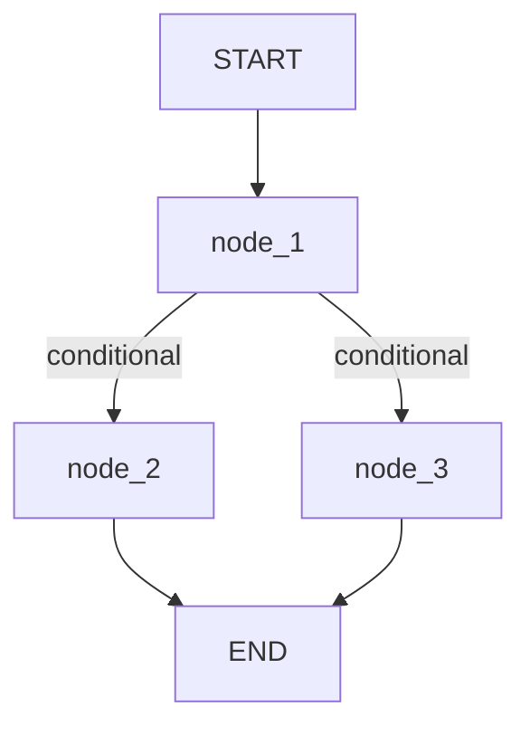

### El gráfico más simple (Node.js)

Vamos a construir un grafo con 3 nodos y un borde condicional, equivalente a la notebook de Python pero usando JavaScript.

### Instalación

```bash
npm i @langchain/langgraph
```

### Estado

El estado será un objeto con una sola clave `graph_state`. Usaremos la API de anotaciones para definir el esquema del estado (por defecto la combinación es de tipo "replace", es decir, cada nodo sobrescribe el valor previo).

```js
import { Annotation } from "@langchain/langgraph";

const State = Annotation.Root({
  graph_state: Annotation(),
});
```

### Nodos

Cada nodo es una función que recibe `state` y devuelve un objeto parcial del estado con la clave a actualizar.

```js
function node_1(state) {
  console.log("---Node 1---");
  return { graph_state: state.graph_state + " I am" };
}

function node_2(state) {
  console.log("---Node 2---");
  return { graph_state: state.graph_state + " happy!" };
}

function node_3(state) {
  console.log("---Node 3---");
  return { graph_state: state.graph_state + " sad!" };
}
```

### Borde condicional

La función devuelve el nombre del siguiente nodo a visitar.

```js
function decide_mood(state) {
  const userInput = state.graph_state; // disponible si quisieras usarlo
  if (Math.random() < 0.5) {
    return "node_2";
  }
  return "node_3";
}
```

### Construcción del grafo

```js
import { StateGraph, START, END } from "@langchain/langgraph";

// Crear el grafo
const builder = new StateGraph(State);

// Registrar nodos
builder.addNode("node_1", node_1);
builder.addNode("node_2", node_2);
builder.addNode("node_3", node_3);

// Definir aristas
builder.addEdge(START, "node_1");
builder.addConditionalEdges("node_1", decide_mood, {
  node_2: "node_2",
  node_3: "node_3",
});
builder.addEdge("node_2", END);
builder.addEdge("node_3", END);

// Compilar
const graph = builder.compile();
```

### Visualización (Mermaid)

Puedes obtener un diagrama Mermaid del grafo y pegarlo en un visor de Mermaid.

```js
const mermaid = graph.getGraph().drawMermaid();
console.log(mermaid);
```

Salida aproximada (puede variar el id):



### Invocación

`invoke` ejecuta el grafo de forma sincrónica (desde `START` hasta `END`) y devuelve el estado final.

```js
(async () => {
  const result = await graph.invoke({ graph_state: "Hi, this is Lance." });
  console.log(result);
  // { graph_state: 'Hi, this is Lance. I am happy!' }
  // o
  // { graph_state: 'Hi, this is Lance. I am sad!' }
})();
```